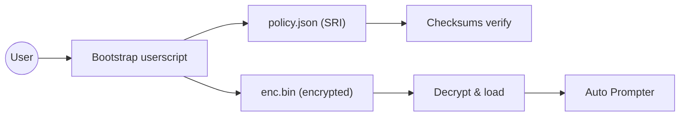

<p align="center"><picture>
  <source srcset="https://samuellane522.github.io/GPT_auto_release/assets/logo.png" type="image/png"/>
  
</picture></p>
<h1 align="center">Auto Prompter <code>03c82e6f2f</code></h1>
<p align="center"><em>Security-first userscript delivery with encrypted bundles, integrity policy (SRI), versioned docs, and one-click install.</em></p>
<p align="center">
  <a href="https://github.com/Samuellane522/GPT_auto_release"></a>
  
  <a href="https://samuellane522.github.io/GPT_auto_release/"></a>
  <a href="https://samuellane522.github.io/GPT_auto_release/verify.html"></a>
  
  
  <br/>
  <a href="https://samuellane522.github.io/GPT_auto_release/beta-release/current/boot/auto-prompter-bootstrap.user.js">
    
  </a>
</p>

[Home](https://github.com/Samuellane522/GPT_auto_release) · [Docs](https://samuellane522.github.io/GPT_auto_release/) · [Install](https://samuellane522.github.io/GPT_auto_release/install.html) · [Verify](https://samuellane522.github.io/GPT_auto_release/verify.html) · [Releases](https://samuellane522.github.io/GPT_auto_release/releases.html) · [Changelog](https://samuellane522.github.io/GPT_auto_release/changelog.html)

> Latest build: `03c82e6f2f`

## Quick Start
1. Install **Tampermonkey** (Chrome / Edge / Firefox).
2. Click **Install Bootstrap** above — your browser will prompt to add the userscript.
3. Open ChatGPT — the bootstrap fetches and decrypts the encrypted bundle automatically.

<details>
<summary><strong>Verify before install</strong> (checksums + SRI policy)</summary>

- Checksums: [checksums.txt]()
- Policy (SRI): [policy.json](https://samuellane522.github.io/GPT_auto_release/download/beta/policy.json)

**enc.bin SRI**
```
sha256-wizWGcOh/2A5QoUFnlD5dgyzofVAzYLSLxuURFj2n+8=
```

**CLI**
```bash
curl -sSfL  | sed -n '1,60p'
```
</details>

## Release Artifacts
| Artifact | Link |
| --- | --- |
| Encrypted bundle (enc.bin) | [download](https://samuellane522.github.io/GPT_auto_release/download/beta/auto-prompter-enc.bin) |
| Bootstrap userscript | [install](https://samuellane522.github.io/GPT_auto_release/beta-release/current/boot/auto-prompter-bootstrap.user.js) |
| Checksums | [checksums.txt]() |
| Remote key | [key.json]() |
| Docs (latest) | [site root](https://samuellane522.github.io/GPT_auto_release/) |
| Docs (build 03c82e6f2f) | [versioned index](https://samuellane522.github.io/GPT_auto_release/v/03c82e6f2f/index.html) |

## Architecture


<details>
<summary><strong>Text fallback</strong> (if Mermaid fails to render)</summary>

```text
User -> Bootstrap userscript -> {policy.json (SRI), enc.bin}
policy.json -> verify checksums
enc.bin -> decrypt & load -> Auto Prompter
```
</details>

## Changelog
See: https://samuellane522.github.io/GPT_auto_release/changelog.html

---
<sub>Generated by the release pipeline.</sub>
